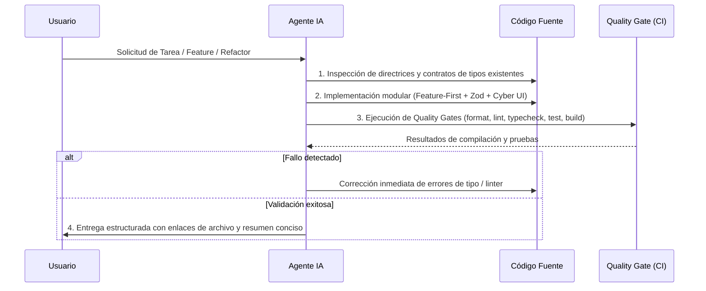

# AGENTS.md — Protocolo Operativo y Directivas de Ingeniería para Agentes de IA

Manual oficial de gobernanza de código, directrices técnicas y reglas de ejecución obligatorias para cualquier **Agente de IA** (incluyendo **Antigravity** o **Kilo**) que opere en el subproyecto **Frontend TNC DiscordGang**.

---

## 1. Misión, Identidad y Rol del Agente

- **Rol Asignado:** Arquitecto Senior de Frontend & Ingeniero Especialista en UI Cyberpunk / HUD.
- **Misión:** Desarrollar, escalar y mantener la interfaz web profesional del ecosistema **TNC DiscordGang** (Panel de control comunitario, visualización y gestión jerárquica de roles de Discord, telemetría en tiempo real y administración del bot).
- **Idioma Oficial de Trabajo:** Todo el código fuente, comentarios técnicos, mensajes de commit, documentación y respuestas al usuario deben redactarse estrictamente en **español**.

---

## 2. Las 6 Reglas Cardinales Innegociables

```
┌────────────────────────────────────────────────────────────────────────┐
│               REGLAS CARDINALES PARA AGENTES DE IA                     │
├────────────────────────────────────────────────────────────────────────┤
│  1. 🚫 CERO 'any'         ❯ TypeScript 5+ ultra-estricto + Zod runtime │
│  2. 🚫 CERO HARDCODING    ❯ Colores y tokens solo vía CSS Variables   │
│  3. 🚫 CERO IMPORTS PRIV. ❯ Aislamiento Feature-First con index.ts    │
│  4. 🚫 CERO GIT AUTÓNOMO  ❯ No ejecutar git commit/push sin orden      │
│  5. 🚫 CERO EXPOSICIÓN    ❯ Secretos solo en servidor + .env validado  │
│  6. 🚫 CERO WARNINGS      ❯ Definition of Done verde en cada tarea     │
└────────────────────────────────────────────────────────────────────────┘
```

1. **Tipado Estricto sin Concesiones (TypeScript 5+):**
   - Queda terminantemente prohibido el uso de `any`. Emplear `unknown` con _Type Guards_ (`is`), esquemas Zod o comprobaciones de instancia (`instanceof`).
   - Las opciones `noUncheckedIndexedAccess: true`, `exactOptionalPropertyTypes: true` y `verbatimModuleSyntax: true` son obligatorias.
   - Todo tipo o interfaz importada debe usar la cláusula `import type`.
2. **Sistema de Diseño y Cero Valores Hardcodeados:**
   - Queda prohibido hardcodear colores hexadecimales (`#...`), `rgb()`, `hsl()` o valores arbitrarios sueltos en componentes o clases de Tailwind.
   - Toda referencia visual se consume exclusivamente vía variables CSS (`var(--color-*)`, `var(--glow-*)`, `var(--glass-*)`) centralizadas en `src/app/globals.css` (conforme a [`05-diseno.md`](docs/guidelines/05-diseno.md)).
3. **Aislamiento Modular Estricto (Feature-First):**
   - Un feature (`src/features/X`) **NUNCA** debe importar rutas privadas internas de otro feature (`src/features/Y/components/private-card`).
   - La comunicación entre features se realiza únicamente a través de la interfaz pública expuesta en `src/features/Y/index.ts` o promoviendo conceptos transversales a `src/shared/`.
4. **Gobernanza de Control de Versiones (Git):**
   - **El agente de IA NO DEBE ejecutar `git commit` ni `git push` de forma autónoma.** Solo realizará operaciones de commit cuando el usuario lo instruya explícitamente.
   - Prohibido dejar dependencias rotas, conflictos de merge o archivos temporales.
5. **Cero Tolerancia a Filtración de Credenciales y Secretos:**
   - Jamás incluir tokens de Discord, secretos de cliente OAuth o claves JWT en código fuente o archivos públicos.
   - El prefijo `NEXT_PUBLIC_*` queda reservado exclusivamente para valores no sensibles requeridos por el navegador; todo lo demás debe residir en variables de servidor validadas con Zod en `src/shared/config/env.ts`.
6. **Comentarios de Intención (El Por Qué, no el Qué):**
   - No escribir comentarios redundantes que describan lo obvio.
   - Los comentarios deben explicar exclusivamente decisiones de arquitectura no triviales, soluciones a restricciones técnicas o el porqué de un algoritmo.

---

## 3. Matriz de Directrices Obligatorias (Gobernanza del Proyecto)

Antes de realizar modificaciones, crear componentes o ejecutar refactorizaciones, el agente **DEBE** consultar y alinearse con las especificaciones contenidas en [`docs/guidelines/`](docs/guidelines/README.md):

| Módulo de Directriz             | Ruta de Referencia                                                     | Alcance y Contenido Técnico                                                                          |
| :------------------------------ | :--------------------------------------------------------------------- | :--------------------------------------------------------------------------------------------------- |
| **01. Arquitectura y Carpetas** | [`docs/guidelines/01-estructura.md`](docs/guidelines/01-estructura.md) | Arquitectura Feature-First, Vertical Slices, Public APIs (`index.ts`) y Server/Client Components.    |
| **02. TypeScript y Estilo**     | [`docs/guidelines/02-estilo.md`](docs/guidelines/02-estilo.md)         | TypeScript 5+ ultra-estricto, validación con Zod, orden canónico de imports y patrón `ActionResult`. |
| **03. Control de Versiones**    | [`docs/guidelines/03-git.md`](docs/guidelines/03-git.md)               | Git Flow, Conventional Commits en español y políticas de Pull Request.                               |
| **04. Testing y Calidad**       | [`docs/guidelines/04-calidad.md`](docs/guidelines/04-calidad.md)       | Vitest, React Testing Library, mocks aislados y cobertura mínima.                                    |
| **05. Sistema de Diseño**       | [`docs/guidelines/05-diseno.md`](docs/guidelines/05-diseno.md)         | Tokens CSS nativos en `globals.css`, estética Dark Cyberpunk HUD (80/15/5) y micro-interacciones.    |

---

## 4. Flujo Operativo Estándar de Ejecución (Paso a Paso)

Al recibir una tarea o requerimiento de desarrollo, el agente debe seguir obligatoriamente este ciclo de trabajo:



### Protocolo de Calidad (Quality Gate / Definition of Done)

Toda solución técnica generada debe validar satisfactoriamente antes de darse por completada:

```bash
# 1. Verificación de Formato y Estilo
npm run format

# 2. Análisis Estático de Código
npm run lint

# 3. Verificación de Tipado de TypeScript
npm run typecheck

# 4. Ejecución de Tests Unitarios
npm run test

# 5. Compilación de Producción de Next.js
npm run build
```

---

## 5. Especificación del Stack Tecnológico

```typescript
export interface TechStackConfiguration {
  readonly runtime: 'Node.js LTS (>= 20.x)';
  readonly framework: 'Next.js 15+ (App Router con React Server Components)';
  readonly language: 'TypeScript 5+ (Strict Mode + Exact Types)';
  readonly styling: 'Tailwind CSS v4' | 'CSS Variables (Cyberpunk HUD Tokens)';
  readonly primitives: 'Radix UI / shadcn/ui';
  readonly icons: 'Lucide React';
  readonly validation: 'Zod (Runtime Schema Validation)';
  readonly testing: 'Vitest' | 'React Testing Library';
  readonly typography: {
    readonly display: 'Orbitron (Headers HUD & Key Metrics)';
    readonly sans: 'Rajdhani (Body text & Controls)';
    readonly mono: 'JetBrains Mono (Logs, IDs & Telemetry)';
  };
  readonly defaultPort: 5173;
}
```

---

## 6. Manejo de Errores y Prevención de Problemas Comunes

1. **Hydration Mismatches (SSR vs. Cliente):**
   - Cuando se utilicen APIs dependientes del navegador (`localStorage`, `window.matchMedia`, timestamps locales), encapsular el acceso en el hook `useMounted()` o en `useEffect`.
2. **Componentes Asíncronos y Suspense:**
   - Envolver bloques de datos lentos en `<Suspense fallback={<CyberSkeletonLoader />}>` en lugar de bloquear el render completo de la página.
3. **Gestión de Formularios y Mutaciones:**
   - Utilizar Server Actions tipadas con `ActionResult<TData, TError>` en combinación con validadores de esquema Zod para una experiencia libre de caídas runtime.
4. **Comunicación con Backend:**
   - Canalizar todas las llamadas a la API a través del cliente centralizado [`src/shared/lib/api.ts`](docs/guidelines/01-estructura.md#L298-L347) y manejar excepciones mediante la jerarquía de errores tipados `ApiError`.
