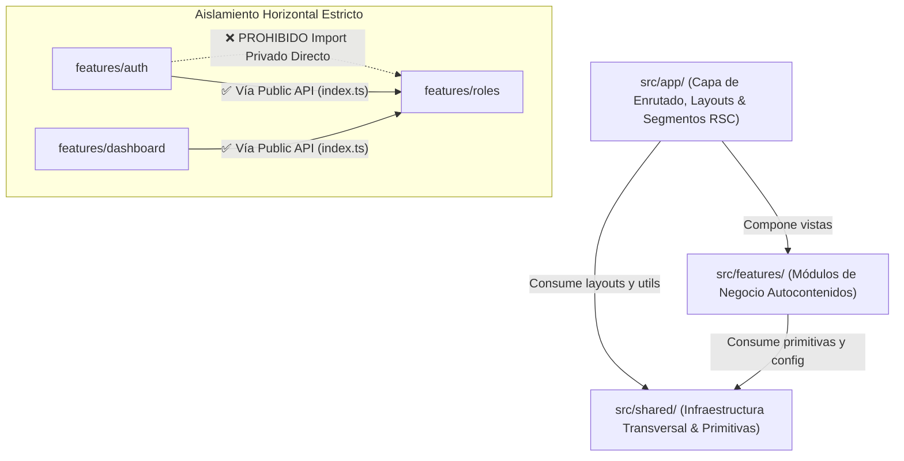

# Directriz 01 — Estructura de Carpetas y Arquitectura Orientada a Módulos (Feature-First)

Guía oficial, exhaustiva y obligatoria de arquitectura de software, organización de carpetas y límites de responsabilidad para el **Frontend TNC DiscordGang**.

---

## 1. Principios de Arquitectura y Filosofía de Diseño

El frontend de **TNC DiscordGang** implementa una **Arquitectura Orientada a Funcionalidades (Feature-First / Vertical Slice Architecture)** combinada con el modelo moderno de **React Server Components (RSC)** en **Next.js (App Router)**.

En lugar de estructurar el código por tipos técnicos de archivos (`controllers/`, `views/`, `components/`), el código se organiza alrededor de los **dominios y capacidades de negocio** (`auth`, `roles`, `dashboard`, `admin`, `miembros`, `actividades`). Cada funcionalidad es un módulo autocontenido que agrupa su propia lógica de API, componentes visuales, hooks de estado, configuración y tipos TypeScript.



### Reglas Cardinales de Arquitectura:

1. **Unidireccionalidad Estricta de Dependencias:** El flujo de dependencias solo desciende: `src/app/` ➔ `src/features/` ➔ `src/shared/`. Nunca en sentido inverso.
2. **Aislamiento Horizontal Modular:** Un módulo `src/features/X` **nunca** debe importar rutas privadas internas de `src/features/Y` (ej. `../../roles/components/role-badge`). Todo consumo entre features se realiza exclusivamente a través del punto de entrada público `src/features/Y/index.ts` o promoviendo la pieza a `src/shared/`.
3. **Capa `src/app/` Ultra-Delgada:** Los archivos `page.tsx` y `layout.tsx` no deben contener lógica de negocio compleja ni maquetación JSX kilométrica; actúan como orquestadores que cargan datos en servidor y ensamblan organismos exportados por `src/features/`.
4. **`src/shared/` Completamente Agnóstico de Dominio:** Ningún archivo dentro de `src/shared/` tiene permitido importar nada desde `src/features/` ni de `src/app/`. Contiene únicamente componentes UI base, utilidades puras, constantes globales y clientes de red genéricos.
5. **Clean Boundaries (Server vs. Client Components):** Todo componente nace como Server Component (RSC) por defecto. La directiva `'use client'` se aísla estrictamente en los nodos hoja interactivos para optimizar el bundle JS enviado al navegador.

---

## 2. Mapa Integral del Repositorio

A continuación se detalla la estructura física completa del proyecto:

```
TNC-DiscordGang-Front/TNC DiscordGang/
├── .env.example                     # Variables de entorno documentadas (públicas y privadas)
├── .eslintrc.json                   # Reglas de linting ultra-estrictas
├── .prettierrc                      # Configuración de formateo y orden de imports
├── AGENTS.md                        # Protocolo operativo y gobernanza para agentes de IA
├── README.md                        # Documentación general y puesta en marcha
├── tsconfig.json                    # Configuración TypeScript 5+ ultra-estricta
├── next.config.ts                   # Configuración del framework Next.js
├── package.json                     # Scripts y dependencias del proyecto
├── public/                          # Assets estáticos servidos directamente
│   ├── brand/                       # Logos TNC, isotipos y favicons
│   ├── fonts/                       # Fuentes locales (fallback offline)
│   ├── sounds/                      # Micro-sonidos tácticos de interfaz HUD
│   └── images/                      # Texturas de grid, scanlines y fondos HUD
├── docs/                            # Documentación técnica de ingeniería
│   └── guidelines/                  # Directrices obligatorias de desarrollo
│       ├── 01-estructura.md         # [Este documento] Arquitectura y carpetas
│       ├── 02-estilo.md             # TypeScript ultra-estricto, ESLint y Zod
│       ├── 03-git.md                # Flujo Git, ramas y Conventional Commits
│       ├── 04-calidad.md            # Vitest, testing de componentes y mocks
│       ├── 05-diseno.md             # Tokens CSS Cyberpunk HUD y globals.css
│       └── README.md                # Índice y gobernanza de directrices
└── src/                             # Código fuente de la aplicación
    ├── app/                         # App Router (Next.js) — Capa de Enrutado
    │   ├── layout.tsx               # Root Layout: Fuentes Google (Orbitron/Rajdhani), ThemeProvider
    │   ├── globals.css              # Tokens CSS nativos, Tailwind CSS v4 y clases Cyber
    │   ├── not-found.tsx            # Pantalla 404 con estética terminal perdida
    │   ├── error.tsx                # Error Boundary global con feedback táctico
    │   ├── loading.tsx              # Skeleton loader cibernético global
    │   ├── page.tsx                 # Landing page pública / Portal de autenticación
    │   ├── (auth)/                  # Route Group para vistas de autenticación
    │   │   ├── login/
    │   │   │   └── page.tsx         # Pantalla de acceso con botón Discord OAuth
    │   │   └── error/
    │   │       └── page.tsx         # Fallo de autenticación / Acceso denegado
    │   ├── dashboard/               # Rutas protegidas del ecosistema
    │   │   ├── layout.tsx           # Layout con Sidebar táctica, HUD Status Bar y Breadcrumbs
    │   │   ├── loading.tsx          # Loader segmentado del panel
    │   │   ├── page.tsx             # Panel principal / Telemetría y accesos rápidos
    │   │   ├── roles/               # Gestión y visualización de jerarquía de roles
    │   │   │   └── page.tsx
    │   │   ├── miembros/            # Directorio y estado de miembros de la comunidad
    │   │   │   └── page.tsx
    │   │   ├── actividades/         # Historial de eventos, logs y recordatorios
    │   │   │   └── page.tsx
    │   │   ├── settings/            # Configuración de usuario y preferencias de HUD
    │   │   │   └── page.tsx
    │   │   └── admin/               # Panel de control maestro (Restringido a Staff/Admin)
    │   │       ├── layout.tsx       # Sub-layout con guardia de permisos administrativos
    │   │       └── page.tsx         # Auditoría, control de bot y configuración global
    │   └── api/                     # Route Handlers (BFF / Proxies de Backend)
    │       ├── auth/
    │       │   ├── callback/route.ts# Receptor del código OAuth y seteo de cookie httpOnly
    │       │   ├── me/route.ts      # Endpoint de sesión activa (cookie parse)
    │       │   └── logout/route.ts  # Purga segura de cookies de sesión
    │       └── health/
    │           └── route.ts         # Healthcheck del frontend
    ├── features/                    # Módulos de Dominio de Negocio (Feature-First)
    │   ├── auth/                    # Autenticación, sesión, JWT y cookies
    │   ├── roles/                   # Jerarquía de roles, niveles, colores y permisos
    │   ├── dashboard/               # Métricas en vivo, telemetría HUD y tarjetas de acceso
    │   ├── admin/                   # Herramientas de staff, auditoría y comandos de bot
    │   ├── miembros/                # Búsqueda, perfiles de usuario y sincronización
    │   └── actividades/             # Eventos, alertas de moderación y recordatorios
    ├── shared/                      # Infraestructura Transversal y Reutilizable
    │   ├── components/              # Componentes de UI comunes
    │   │   ├── ui/                  # Componentes base accesibles (Radix UI / Primitivas)
    │   │   ├── cyber/               # Componentes especializados Cyberpunk HUD
    │   │   └── layout/              # Estructuras de layout compartidas (Header, Sidebar)
    │   ├── config/                  # Configuración global, constantes y rutas
    │   ├── hooks/                   # Custom hooks genéricos y de entorno
    │   ├── lib/                     # Clientes de API, manejo de errores y utilidades
    │   └── types/                   # Interfaces globales, enums y respuestas base
    └── middleware.ts                # Guardia perimetral de rutas (validación de sesión)
```

---

## 3. Anatomía Canónica de un Módulo de Funcionalidad (`src/features/<nombre>`)

Cada módulo en `src/features/` sigue una estructura estandarizada y predecible. Se crean únicamente las carpetas que el módulo realmente requiera:

```
src/features/roles/
├── api/                             # Clientes de API y Server Actions del feature
│   ├── get-discord-roles.ts         # Fetch tipado a /api/v1/auth/discord/roles
│   └── update-role-permissions.ts   # Server Action para mutar permisos
├── components/                      # Componentes visuales del dominio
│   ├── role-badge.tsx               # Insignia de rol con color y glow
│   ├── role-hierarchy-tree.tsx      # Árbol visual de jerarquía de roles
│   └── role-permission-matrix.tsx   # Tabla de permisos interactiva
├── config/                          # Constantes y mapas específicos del feature
│   └── roles.config.ts              # Niveles mínimos, roles protegidos y colores por defecto
├── hooks/                           # Hooks de estado o queries del feature
│   ├── use-discord-roles.ts         # Hook de consulta de roles con caché
│   └── use-role-permissions.ts      # Verificación reactiva de permisos
├── lib/                             # Lógica de dominio pura y algoritmos
│   ├── format-role-color.ts         # Conversión de colores Discord a CSS tokens
│   └── has-permission.ts            # Algoritmo de comprobación de permisos por bitmask
├── types/                           # Contratos TypeScript del dominio
│   ├── role.types.ts                # Interfaces de rol, permisos y jerarquía
│   └── index.ts                     # Barrel export de tipos del feature
└── index.ts                         # PUBLIC API del feature (únicos exports accesibles externamente)
```

### 3.1. Tabla de Responsabilidades por Capa de Feature

| Carpeta       | Responsabilidad Técnica                                                  | Ejemplo Práctico                                      |
| :------------ | :----------------------------------------------------------------------- | :---------------------------------------------------- |
| `api/`        | Comunicación HTTP con NestJS y Server Actions tipadas                    | `get-session.ts`, `sync-roles-action.ts`              |
| `components/` | Componentes visuales exclusivos del dominio                              | `ProfileCard`, `RoleBadge`, `AuditLogTable`           |
| `hooks/`      | Hooks reactivos, SWR/React Query o listeners                             | `useSession`, `useAuditLogs`, `usePermissions`        |
| `config/`     | Valores constantes inmutables y diccionarios de configuración            | `auth.config.ts`, `roles.config.ts`                   |
| `lib/`        | Funciones puras, helpers matemáticos y validadores                       | `decode-token.ts`, `calculate-rank.ts`                |
| `types/`      | Tipos, interfaces y esquemas Zod del dominio                             | `SessionUser`, `DiscordGuildRole`                     |
| `index.ts`    | **Fachada pública (Public API):** Solo expone lo consumible externamente | `export { RoleBadge } from './components/role-badge'` |

### 3.2. Patrón Public API (`index.ts`)

Para preservar el encapsulamiento modular, todo archivo fuera de `src/features/roles/` consume sus piezas a través del `index.ts` raíz del feature:

```typescript
// src/features/roles/index.ts
// ✅ Componentes Públicos
export { RoleBadge } from './components/role-badge';
export { RoleHierarchyTree } from './components/role-hierarchy-tree';

// ✅ Hooks Públicos
export { useDiscordRoles } from './hooks/use-discord-roles';
export { useRolePermissions } from './hooks/use-role-permissions';

// ✅ Lógica y Helpers Públicos
export { hasPermission } from './lib/has-permission';

// ✅ Tipos Públicos (Separados con 'export type')
export type { DiscordRole, RolConfig, RolNivel, PermisoKey } from './types/role.types';
```

---

## 4. Estructura y Taxonomía de `src/shared/`

La carpeta `src/shared/` proporciona la infraestructura base sobre la que se construyen todos los features. No contiene lógica específica de un único dominio de negocio.

```
src/shared/
├── components/
│   ├── ui/                          # Primitivas accesibles (basadas en Radix UI)
│   │   ├── button.tsx
│   │   ├── input.tsx
│   │   ├── dialog.tsx
│   │   ├── dropdown-menu.tsx
│   │   ├── tooltip.tsx
│   │   ├── avatar.tsx
│   │   └── separator.tsx
│   ├── cyber/                       # Componentes temáticos Cyberpunk HUD
│   │   ├── neon-button.tsx          # Botón táctico con biselado y glow
│   │   ├── glass-card.tsx           # Contenedor con cristal ahumado y retículas
│   │   ├── cyber-badge.tsx          # Insignia poligonal con indicador LED
│   │   ├── cyber-input.tsx          # Input con cursor terminal y láser
│   │   ├── cyber-grid.tsx           # Matriz de fondo de perspectiva 3D
│   │   ├── hud-status-bar.tsx       # Barra de telemetría y reloj del sistema
│   │   ├── glitch-text.tsx          # Texto con distorsión RGB animada
│   │   └── status-pulse.tsx         # Punto sonar de estado de conexión
│   └── layout/                      # Estructuras de layout transversales
│       ├── sidebar.tsx              # Barra lateral de navegación principal
│       ├── header.tsx               # Encabezado superior con perfil y alertas
│       └── breadcrumbs.tsx          # Navegación jerárquica estilo terminal
├── config/
│   ├── env.ts                       # Validación estricta de variables con Zod
│   ├── site.ts                      # Metadatos del sitio, links y versión
│   └── routes.ts                    # Diccionario de rutas protegidas y públicas
├── hooks/
│   ├── use-media-query.ts           # Detección reactiva de breakpoints
│   ├── use-local-storage.ts         # Persistencia local con tipado seguro
│   ├── use-mounted.ts               # Prevención de hydration mismatches
│   └── use-sound-fx.ts              # Efectos de audio táctico sutiles
├── lib/
│   ├── api.ts                       # Cliente fetch centralizado con interceptores
│   ├── utils.ts                     # Helper `cn()` (clsx + tailwind-merge)
│   └── errors.ts                    # Clases de error estandarizadas (AppError, ApiError)
└── types/
    ├── api.types.ts                 # Envoltorios de respuesta API ({ data, error, meta })
    └── common.types.ts              # Tipos utilitarios (Nullable, AsyncState, Option)
```

---

## 5. Taxonomía de Componentes: Atomic Design Adaptado

Dentro del proyecto, los componentes siguen una adaptación pragmática de **Atomic Design**:

```
┌────────────────────────────────────────────────────────────────────────┐
│  VISTAS / PÁGINAS (app/**/page.tsx)                                    │
│  └── ORGANISMOS (Sidebar, RolePermissionMatrix, DashboardGrid)         │
│      └── MOLÉCULAS (UserAvatarWithRole, SearchFilterHUD, TelemetryCard)│
│          └── ÁTOMOS (NeonButton, CyberBadge, Input, SonarPulse)        │
└────────────────────────────────────────────────────────────────────────┘
```

- **Átomos (`shared/components/ui/` y `shared/components/cyber/`):** Elementos indivisibles y reutilizables sin estado de negocio (Button, Input, Avatar, StatusDot, NeonButton, GlassCard).
- **Moléculas (`shared/components/` y `features/<modulo>/components/`):** Combinación de dos o más átomos con un propósito acotado (UserAvatar con Badge, SearchBar con botón de filtro).
- **Organismos (`features/<modulo>/components/` y `shared/components/layout/`):** Módulos complejos con estado, integración de servicios y lógica de dominio (Sidebar con navegación según permisos, RolePermissionMatrix, MemberGrid).
- **Plantillas / Layouts (`app/**/layout.tsx`):** Estructura del marco visual de la aplicación.
- **Páginas (`app/**/page.tsx`):** Orquestadores en servidor que resuelven datos y renderizan los organismos.

---

## 6. Estrategia de Enrutado y Server vs. Client Components (RSC)

### 6.1. División de Responsabilidades en App Router

Next.js App Router prioriza los **React Server Components (RSC)**. Se debe aplicar la regla de la superficie mínima de cliente (_Minimum Client Surface Area_):

```
┌─────────────────────────────────────────────────────────────┐
│  page.tsx (Server Component - Carga de datos en servidor)    │
│  │                                                          │
│  ├── Header (Server Component - Render estático)            │
│  │                                                          │
│  └── RolePermissionMatrix (Client Component - 'use client') │
│      ❯ Controles interactivos, estados locales y mutaciones │
└─────────────────────────────────────────────────────────────┘
```

1. **`page.tsx` & `layout.tsx` (Server Components por defecto):**
   - Realizan la carga de datos inicial directa o mediante Server Actions sin exponer tokens en el cliente.
   - Manejan la protección de ruta y redirecciones tempranas con `redirect()`.
   - Pasan los datos serializados como props a los componentes interactivos.
2. **Componentes Interactivos (`'use client'`):**
   - Se coloca la directiva `'use client'` únicamente en las hojas del árbol de componentes que requieran eventos del DOM (`onClick`, `onChange`), hooks de React (`useState`, `useEffect`) o APIs del navegador (`localStorage`, `window`).
   - **Prohibido** envolver páginas completas con `'use client'`.

### 6.2. Manejo de Estados Especiales por Segmento

Cada segmento de ruta principal en `src/app/` debe definir sus pantallas de estado:

- **`loading.tsx`:** Muestra skeletons animados con temática cyberpunk mientras el servidor resuelve datos asíncronos.
- **`error.tsx`:** Captura excepciones del segmento y ofrece botón de reintento táctico (`RESET SYSTEM`).
- **`not-found.tsx`:** Presenta una interfaz de fallo de coordenadas HUD cuando un recurso no existe.

---

## 7. Patrón de Comunicación con Backend (`shared/lib/api.ts`)

Todas las peticiones HTTP hacia el backend de NestJS pasan a través del cliente unificado `apiFetch`:

```typescript
// src/shared/lib/api.ts
import { env } from '@/shared/config/env';
import { ApiError } from './errors';

interface FetchOptions extends RequestInit {
  params?: Record<string, string | number | boolean | undefined>;
  token?: string;
}

export async function apiFetch<TResponse>(
  endpoint: string,
  options: FetchOptions = {}
): Promise<TResponse> {
  const { params, token, headers, ...restOptions } = options;

  let url = `${env.NEXT_PUBLIC_API_URL}${endpoint}`;
  if (params) {
    const searchParams = new URLSearchParams();
    Object.entries(params).forEach(([key, value]) => {
      if (value !== undefined) searchParams.append(key, String(value));
    });
    const queryString = searchParams.toString();
    if (queryString) url += `?${queryString}`;
  }

  const authHeader: Record<string, string> = token ? { Authorization: `Bearer ${token}` } : {};

  const response = await fetch(url, {
    headers: {
      'Content-Type': 'application/json',
      ...authHeader,
      ...headers,
    },
    ...restOptions,
  });

  if (!response.ok) {
    const errorBody = await response.json().catch(() => ({}));
    throw new ApiError(
      errorBody.message || 'Error en la comunicación con el servidor',
      response.status,
      errorBody.code
    );
  }

  return response.json() as Promise<TResponse>;
}
```

---

## 8. Checklists de Calidad Arquitectónica y Anti-Patrones

### 8.1. Checklist de Creación de Módulos (Feature Definition of Done)

Antes de dar por completado un feature, verificar:

- [ ] Todo el código del dominio reside dentro de `src/features/<nombre>/`.
- [ ] Existe un archivo `index.ts` en la raíz del feature que actúa como única puerta de exportación pública.
- [ ] Ningún componente del feature hace llamadas directas a `fetch`; todas las consultas se tipan en `features/<nombre>/api/`.
- [ ] No existen dependencias circulares ni importaciones directas desde carpetas privadas de otros features.
- [ ] Todos los estilos consumen variables CSS de `05-diseno.md` (`globals.css`); cero valores hexadecimales hardcodeados.

### 8.2. Ejemplos de Buenas y Malas Prácticas

#### ❌ Incorrecto (Rompe el encapsulamiento modular):

```tsx
// En src/features/dashboard/components/dashboard-view.tsx
import { UserAvatar } from '../../auth/components/user-avatar'; // ❌ Import privado entre features
import { getRolesFromApi } from '../../roles/lib/api-helper'; // ❌ Rompe la arquitectura
```

#### ✅ Correcto (Consume via Public API o Shared):

```tsx
// En src/features/dashboard/components/dashboard-view.tsx
import { UserAvatar } from '@/features/auth'; // ✅ Vía Public API del feature
import { useDiscordRoles } from '@/features/roles'; // ✅ Vía Public API del feature
import { GlassCard } from '@/shared/components/cyber'; // ✅ Vía Shared
```
